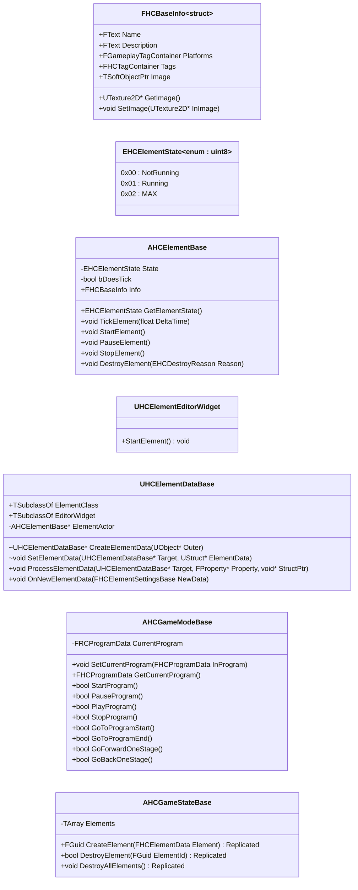
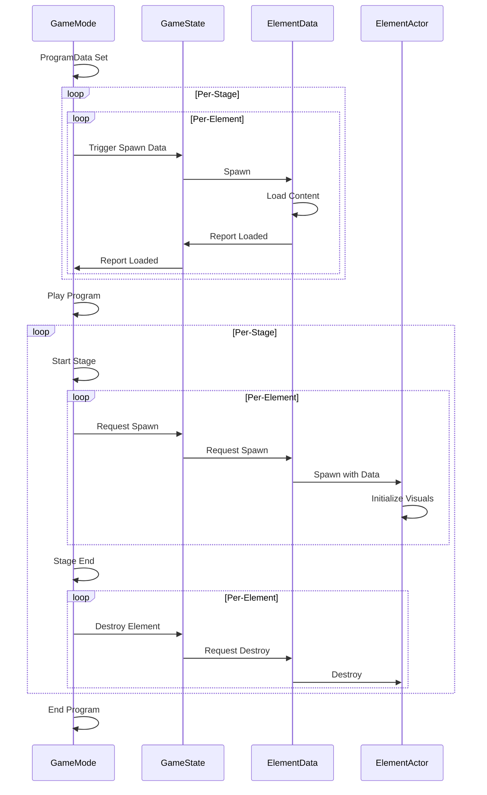

# Hypno.exe Technical Documentation

## Overview

## Class Diagrams

### Program Classes

## Primary Processes

### Program Playback

### Program Library

### Program Editing

#### Add Stage

#### Remove Stage

#### Add Element

#### Edit Element

#### Remove Element

### Program Exporting

### Program Importing
