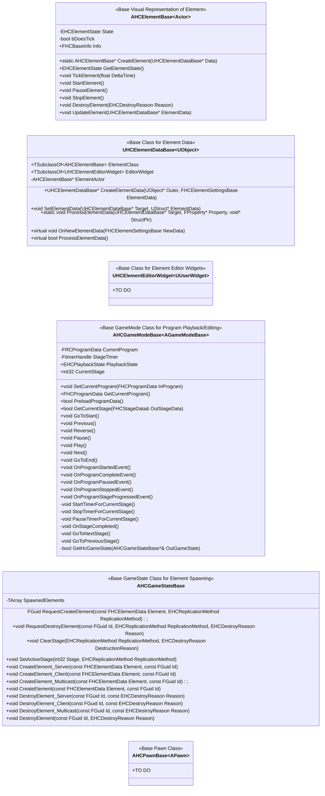

```mermaid
classDiagram
direction LR

class AHCElementBase~Actor~{
    <<Base Visual Representation of Element>>
    -EHCElementState State
    -bool bDoesTick
    +FHCBaseInfo Info
    +static AHCElementBase* CreateElement(UHCElementDataBase* Data)
    +EHCElementState GetElementState()
    +void TickElement(float DeltaTime)
    +void StartElement()
    +void PauseElement()
    +void StopElement()
    +void DestroyElement(EHCDestroyReason Reason)
    +void UpdateElement(UHCElementDataBase* ElementData)
}

class UHCElementDataBase~UObject~{
    <<Base Class for Element Data>>
    +TSubclassOf~AHCElementBase~ ElementClass
    +TSubclassOf~UHCElementEditorWidget~ EditorWidget
    -AHCElementBase* ElementActor
    +UHCElementDataBase* CreateElementData(UObject* Outer, FHCElementSettingsBase ElementData)
    +void SetElementData(UHCElementDataBase* Target, UStruct* ElementData)
    +static void ProcessElementData(UHCElementDataBase* Target, FProperty* Property, void* StructPtr)
    +virtual void OnNewElementData(FHCElementSettingsBase NewData)
    +virtual bool ProcessElementData()
}

class UHCElementEditorWidget~UUserWidget~{
    <<Base Class for Element Editor Widgets>>
    +TO DO
}

class AHCGameModeBase~AGameModeBase~{
    <<Base GameMode Class for Program Playback/Editing>>
    -FRCProgramData CurrentProgram
    -FtimerHandle StageTimer
    +EHCPlaybackState PlaybackState
    +int32 CurrentStage
    +void SetCurrentProgram(FHCProgramData InProgram)
    +FHCProgramData GetCurrentProgram()
    +bool PreloadProgramData()
    +bool GetCurrentStage(FHCStageData& OutStageData)
    +void GoToStart()
    +void Previous()
    +void Reverse()
    +void Pause()
    +void Play()
    +void Next()
    +void GoToEnd()
    +void OnProgramStartedEvent()
    +void OnProgramCompleteEvent()
    +void OnProgramPausedEvent()
    +void OnProgramStoppedEvent()
    +void OnProgramStageProgressedEvent()
    -void StartTimerForCurrentStage()
    -void StopTimerForCurrentStage()
    -void PauseTimerForCurrentStage()
    -void OnStageCompleted()
    -void GoToNextStage()
    -void GoToPreviousStage()
    -bool GetHcGameState(AHCGameStateBase*& OutGameState)
}

class AHCGameStateBase{
    <<Base GameState Class for Element Spawning>>
    -TArray<AHCElementBase*> SpawnedElements
	FGuid RequestCreateElement(const FHCElementData Element, EHCReplicationMethod ReplicationMethod);
	+void RequestDestroyElement(const FGuid Id, EHCReplicationMethod ReplicationMethod, EHCDestroyReason Reason)
	+void ClearStage(EHCReplicationMethod ReplicationMethod, EHCDestroyReason DestructionReason)
	+void SetActiveStage(int32 Stage, EHCReplicationMethod ReplicationMethod)
	+void CreateElement_Server(const FHCElementData Element, const FGuid Id)
	+void CreateElement_Client(const FHCElementData Element, const FGuid Id)
	+void CreateElement_Multicast(const FHCElementData Element, const FGuid Id);
	+void CreateElement(const FHCElementData Element, const FGuid Id)
	+void DestroyElement_Server(const FGuid Id, const EHCDestroyReason Reason)
	+void DestroyElement_Client(const FGuid Id, const EHCDestroyReason Reason)
	+void DestroyElement_Multicast(const FGuid Id, const EHCDestroyReason Reason)
	+void DestroyElement(const FGuid Id, EHCDestroyReason Reason)
}

class AHCPawnBase~APawn~{
    <<Base Pawn Class>>
    +TO DO
}
```
