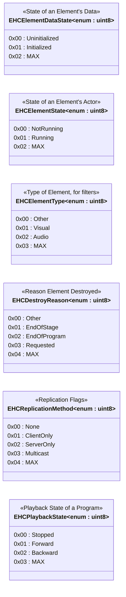

```mermaid
classDiagram
direction LR

class EHCElementDataState~enum : uint8~{
  <<State of an Element's Data>>
  0x00 : Uninitialized
	0x01 : Initialized
	0x02 : MAX
}

class EHCElementState~enum : uint8~{
  <<State of an Element's Actor>>
  0x00 : NotRunning
	0x01 : Running
	0x02 : MAX
}

class EHCElementType~enum : uint8~{
  <<Type of Element, for filters>>
  0x00 : Other
	0x01 : Visual
	0x02 : Audio
  0x03 : MAX
}

class EHCDestroyReason~enum : uint8~{
  <<Reason Element Destroyed>>
  0x00 : Other
	0x01 : EndOfStage
	0x02 : EndOfProgram
  0x03 : Requested
  0x04 : MAX
}

class EHCReplicationMethod~enum : uint8~{
  <<Replication Flags>>
  0x00 : None
	0x01 : ClientOnly
	0x02 : ServerOnly
  0x03 : Multicast
  0x04 : MAX
}

class EHCPlaybackState~enum : uint8~{
  <<Playback State of a Program>>
  0x00 : Stopped
	0x01 : Forward
	0x02 : Backward
  0x03 : MAX
}
```
