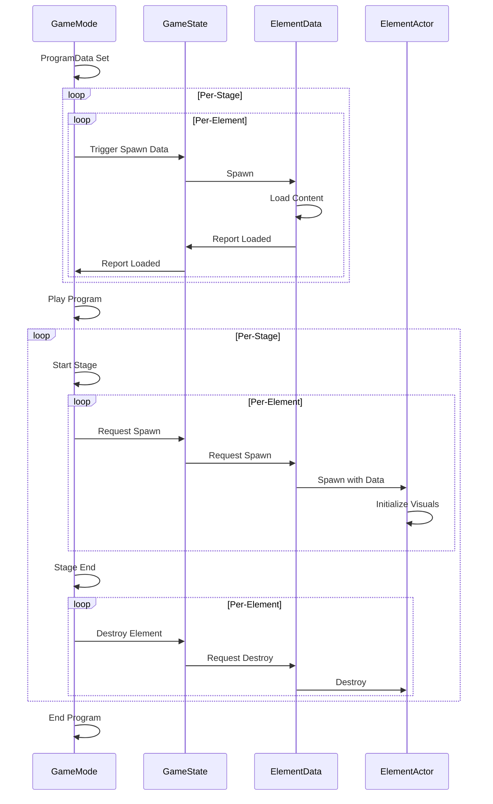

```mermaid
sequenceDiagram

participant GameMode
participant GameState
participant ElementData
participant ElementActor

GameMode ->> GameMode : ProgramData Set

loop Per-Stage
    loop Per-Element
        GameMode ->> GameState : Trigger Spawn Data
        GameState ->> ElementData : Spawn
        ElementData ->> ElementData : Load Content
        ElementData ->> GameState : Report Loaded
        GameState ->> GameMode : Report Loaded
    end
end

GameMode ->> GameMode : Play Program

loop Per-Stage

    GameMode ->> GameMode : Start Stage

    loop Per-Element
        GameMode ->> GameState : Request Spawn
        GameState ->> ElementData : Request Spawn
        ElementData ->> ElementActor : Spawn with Data
        ElementActor ->> ElementActor : Initialize Visuals
    end

    GameMode ->> GameMode : Stage End

    loop Per-Element
        GameMode ->> GameState : Destroy Element
        GameState ->> ElementData : Request Destroy
        ElementData ->> ElementActor : Destroy
    end
end

GameMode ->> GameMode : End Program

```
