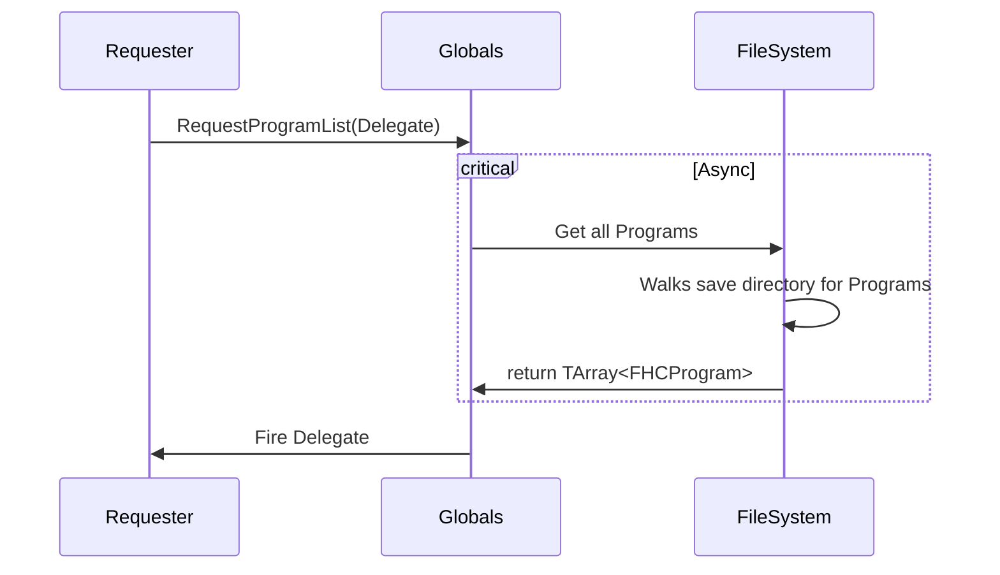
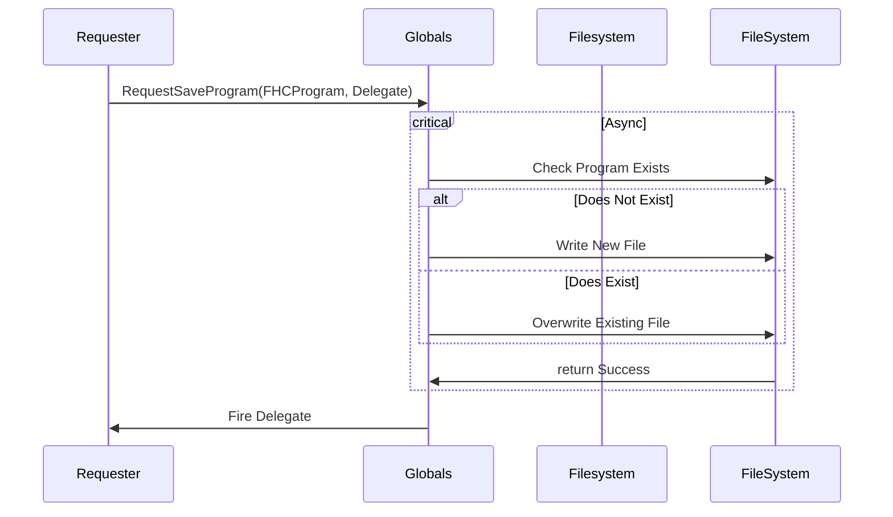
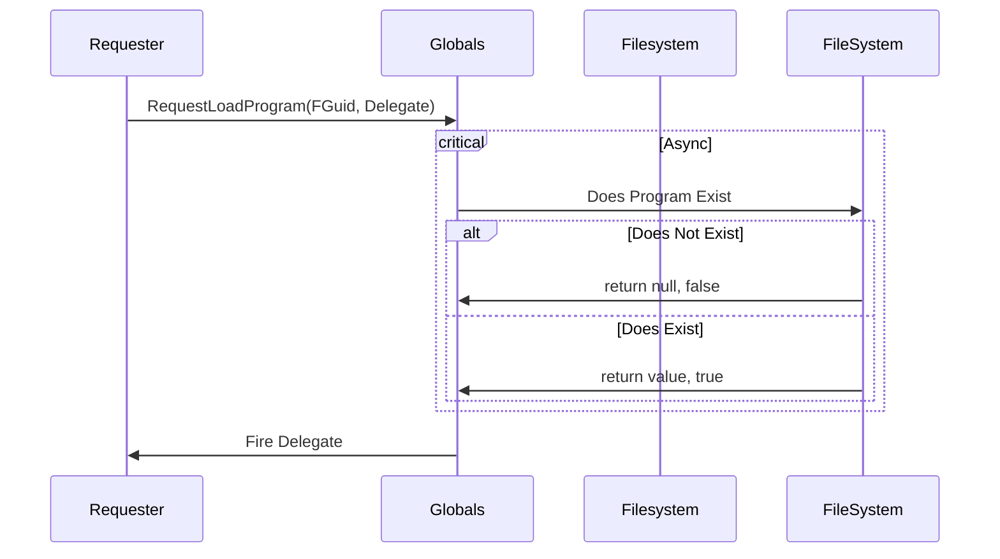
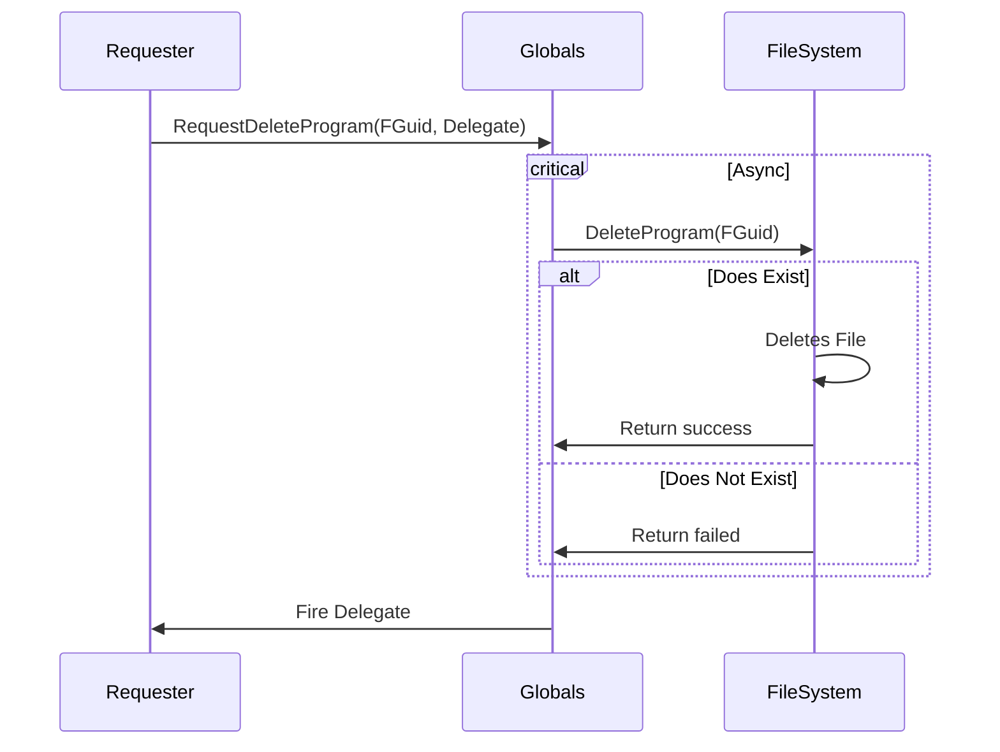

#### Get Program List

```mermaid
sequenceDiagram

participant Requester
participant Globals
participant FileSystem

Requester ->> Globals : RequestProgramList(Delegate)

critical Async
    Globals ->> FileSystem : Get all Programs
    FileSystem ->> FileSystem : Walks save directory for Programs
    FileSystem ->> Globals : return TArray<FHCProgram>
end

Globals ->> Requester : Fire Delegate

```

#### Save Program

```mermaid
sequenceDiagram

participant Requester
participant Globals
participant Filesystem

Requester ->> Globals : RequestSaveProgram(FHCProgram, Delegate)

critical Async
    Globals ->> FileSystem : Check Program Exists

    alt Does Not Exist
        Globals ->> FileSystem : Write New File
    else Does Exist
        Globals ->> FileSystem : Overwrite Existing File
    end

    FileSystem ->> Globals : return Success
end

Globals ->> Requester : Fire Delegate

```

#### Load Program

```mermaid
sequenceDiagram

participant Requester
participant Globals
participant Filesystem

Requester ->> Globals : RequestLoadProgram(FGuid, Delegate)

critical Async
    Globals ->> FileSystem : Does Program Exist

    alt Does Not Exist
        FileSystem ->> Globals : return null, false
    else Does Exist
        FileSystem ->> Globals : return value, true
    end
end

Globals ->> Requester : Fire Delegate

```

#### Delete Program

```mermaid
sequenceDiagram

participant Requester
participant Globals
participant FileSystem

Requester ->> Globals : RequestDeleteProgram(FGuid, Delegate)

critical Async
    Globals ->> FileSystem : DeleteProgram(FGuid)

    alt Does Exist
        FileSystem ->> FileSystem : Deletes File
        FileSystem ->> Globals : Return success
    else Does Not Exist
        FileSystem ->> Globals : Return failed
    end
end

Globals ->> Requester : Fire Delegate

```
