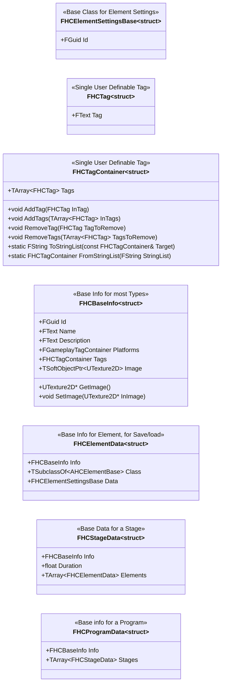

```mermaid
classDiagram
direction LR

class FHCElementSettingsBase~struct~{
    <<Base Class for Element Settings>>
    +FGuid Id
}

class FHCTag~struct~{
    <<Single User Definable Tag>>
    +FText Tag
}

class FHCTagContainer~struct~{
    <<Single User Definable Tag>>
    +TArray~FHCTag~ Tags
    +void AddTag(FHCTag InTag)
    +void AddTags(TArray~FHCTag~ InTags)
    +void RemoveTag(FHCTag TagToRemove)
    +void RemoveTags(TArray~FHCTag~ TagsToRemove)
    +static FString ToStringList(const FHCTagContainer& Target)
    +static FHCTagContainer FromStringList(FString StringList)

}

class FHCBaseInfo~struct~{
    <<Base Info for most Types>>
    +FGuid Id
    +FText Name
    +FText Description
    +FGameplayTagContainer Platforms
    +FHCTagContainer Tags
    +TSoftObjectPtr~UTexture2D~ Image
    +UTexture2D* GetImage()
    +void SetImage(UTexture2D* InImage)
}

class FHCElementData~struct~{
    <<Base Info for Element, for Save/load>>
    +FHCBaseInfo Info
    +TSubclassOf~AHCElementBase~ Class
    +FHCElementSettingsBase Data
}

class FHCStageData~struct~{
    <<Base Data for a Stage>>
    +FHCBaseInfo Info
    +float Duration
    +TArray~FHCElementData~ Elements
}

class FHCProgramData~struct~{
    <<Base info for a Program>>
    +FHCBaseInfo Info
    +TArray~FHCStageData~ Stages
}
```
